fla9s
=====

9x9 flags

####A[B](#b)[C](#c)[D](#d)[E](#e)[F](#f)[G](#g)[H](#h)[I](#i)[J](#j)[K](#k)[L](#l)[M](#m)[N](#n)[O](#o)[P](#p)[Q](#q)[R](#r)[S](#s)[T](#t)[U](#u)[V](#v)[Y](#y)[Z](#z)
| A           |ISO | Country
|-------------|----|-----------------
|  | AF | Afghanistan |
|  | AX | Åland Islands |
|  | AL | Albania |
|  | DZ | Algeria |
|  | AS | American Samoa |
| 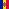 | AD | Andorra |
| 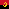 | AO | Angola |
|  | AI | Anguilla |
|  | AQ | Antarctica |
|  | XX | Antigua and Barbuda |
|  | AR | Argentina |
| 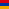 | AM | Armenia |
|  | AW | Aruba |
|  | AU | Australia |
| 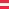 | AT | Austria |
| 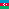 | AZ | Azerbaijan |
####B
| B           |ISO | Country
|-------------|----|-----------------
|  | BS | Bahamas |
|  | BH | Bahrain |
|  | BD | Bangladesh |
|  | BB | Barbados |
|  | BY | Belarus |
| 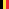 | BE | Belgium |
|  | BZ | Belize |
|  | BJ | Benin |
|  | BM | Bermuda |
|  | BT | Bhutan |
| 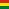 | BO | Bolivia, Plurinational State of |
|  | BQ | Bonaire, Sint Eustatius and Saba |
|  | BA | Bosnia and Herzegovina |
|  | BW | Botswana |
|  | BV | Bouvet Island |
|  | BR | Brazil |
|  | IO | British Indian Ocean Territory |
|  | BN | Brunei Darussalam |
|  | BG | Bulgaria |
| 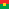 | BF | Burkina Faso |
|  | BI | Burundi |
####C
| C           |ISO | Country
|-------------|----|-----------------
|  | KH | Cambodia |
| 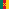 | CM | Cameroon |
|  | CA | Canada |
|  | CV | Cabo Verde |
|  | KY | Cayman Islands |
|  | CF | Central African Republic |
| 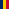 | TD | Chad |
|  | CL | Chile |
| 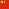 | CN | China |
|  | CX | Christmas Island |
|  | CC | Cocos (Keeling) Islands |
|  | CO | Colombia |
|  | KM | Comoros |
|  | CG | Congo |
|  | CD | Congo, the Democratic Republic of the |
|  | CK | Cook Islands |
| 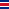 | CR | Costa Rica |
| 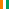 | CI | Côte d'Ivoire |
|  | HR | Croatia |
|  | CU | Cuba |
|  | CW | Curaçao |
|  | CY | Cyprus |
|  | CZ | Czech Republic |
####D
| D           |ISO | Country
|-------------|----|-----------------
|  | DK | Denmark |
|  | DJ | Djibouti |
|  | DM | Dominica |
|  | DO | Dominican Republic |
####E
| E           |ISO | Country
|-------------|----|-----------------
|  | EC | Ecuador |
| 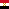 | EG | Egypt |
|  | SV | El Salvador |
|  | GQ | Equatorial Guinea |
|  | ER | Eritrea |
|  | EE | Estonia |
| 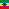 | ET | Ethiopia |
####F
| F           |ISO | Country
|-------------|----|-----------------
|  | FK | Falkland Islands (Malvinas) |
|  | FO | Faroe Islands |
|  | FJ | Fiji |
|  | FI | Finland |
| 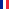 | FR | France |
|  | GF | French Guiana |
|  | PF | French Polynesia |
|  | TF | French Southern Territories |
####G
| G           |ISO | Country
|-------------|----|-----------------
|  | GA | Gabon |
|  | GM | Gambia |
|  | GE | Georgia |
| 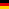 | DE | Germany |
| 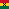 | GH | Ghana |
|  | GI | Gibraltar |
|  | GR | Greece |
|  | GL | Greenland |
|  | GD | Grenada |
|  | GP | Guadeloupe |
|  | GU | Guam |
|  | GT | Guatemala |
|  | GG | Guernsey |
|  | GN | Guinea |
|  | GW | Guinea-Bissau |
|  | GY | Guyana |
####H
| H           |ISO | Country
|-------------|----|-----------------
|  | HT | Haiti |
|  | HM | Heard Island and McDonald Islands |
|  | VA | Holy See (Vatican City State) |
|  | HN | Honduras |
|  | HK | Hong Kong |
| 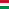 | HU | Hungary |
####I
| I           |ISO | Country
|-------------|----|-----------------
|  | HU | Hungary |
|  | HU | Hungary |
|  | HU | Hungary |
|  | HU | Hungary |
|  | HU | Hungary |
Iceland 	IS 	ISL 	352 	ISO 3166-2:IS
India 	IN 	IND 	356 	ISO 3166-2:IN
Indonesia 	ID 	IDN 	360 	ISO 3166-2:ID
Iran, Islamic Republic of 	IR 	IRN 	364 	ISO 3166-2:IR
Iraq 	IQ 	IRQ 	368 	ISO 3166-2:IQ
Ireland 	IE 	IRL 	372 	ISO 3166-2:IE
Isle of Man 	IM 	IMN 	833 	ISO 3166-2:IM
Israel 	IL 	ISR 	376 	ISO 3166-2:IL
Italy 	IT 	ITA 	380 	ISO 3166-2:IT
####J
| J           |ISO | Country
|-------------|----|-----------------
####K
| K           |ISO | Country
|-------------|----|-----------------
####L
| L           |ISO | Country
|-------------|----|-----------------
####M
| M           |ISO | Country
|-------------|----|-----------------
####N
| N           |ISO | Country
|-------------|----|-----------------
####O
| O           |ISO | Country
|-------------|----|-----------------
####P
| P           |ISO | Country
|-------------|----|-----------------
####Q
| Q           |ISO | Country
|-------------|----|-----------------
####R
| R           |ISO | Country
|-------------|----|-----------------
####S
| S           |ISO | Country
|-------------|----|-----------------
####T
| T           |ISO | Country
|-------------|----|-----------------
####U
| U           |ISO | Country
|-------------|----|-----------------
####V
| V           |ISO | Country
|-------------|----|-----------------
####Y
| Y           |ISO | Country
|-------------|----|-----------------
####Z
| Z           |ISO | Country
|-------------|----|-----------------
