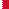
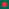

fla9s
=====

9x9 flags

####A[B](#B)
| A           |ISO | Country        
|-------------|----|-----------------
|  | AF | Afghanistan] |
|  | AX | Åland Islands |
|  | AL | Albania |
|  | DZ | Algeria |
|  | AS | American Samoa |
|  | XX | XX |
|  | AD | Andorra |
|  | AO | Angola |
|  | AI | Anguilla |
|  | AQ | Antarctica |
|  | XX | Antigua and Barbuda |
|  | AR | Argentina |
|  | AM | Armenia |
|  | AW | Aruba |
|  | AU | Australia |
|  | AT | Austria |
|  | AZ | Azerbaijan |
####B
| B           |ISO | Country        
|-------------|----|-----------------
|  | BS | Bahamas |
|  | BH | Bahrain |
|  | BD | Bangladesh |
|  | BB | Barbados |
|  | BY | Belarus |
|  | BE | Belgium |
|  | BZ | Belize |
|  | BJ | Benin |
|  | BM | Bermuda |
|  | BT | Bhutan |
|  | BO | Bolivia, Plurinational State of |
|  | BQ | Bonaire, Sint Eustatius and Saba |
|  | BA | Bosnia and Herzegovina |
|  | BW | Botswana |
|  | BV | Bouvet Island |
|  | BR | Brazil |
|  | IO | British Indian Ocean Territory |
|  | BN | Brunei Darussalam |
|  | BG | Bulgaria |
|  | BF | Burkina Faso |
|  | BI | Burundi |
####C
