fla9s
=====

9x9 flags

####A[B](#b)[C](#c)[D](#d)[E](#e)[F](#f)[G](#g)[H](#h)[I](#i)[J](#j)[K](#k)[L](#l)[M](#m)[N](#n)[O](#o)[P](#p)[Q](#q)[R](#r)[S](#s)[T](#t)[U](#u)[V](#v)[W](#w)[Y](#y)[Z](#z)
| A           |ISO | Country
|-------------|----|-----------------
|  | AF | Afghanistan |
|  | AX | Åland Islands |
|  | AL | Albania |
|  | DZ | Algeria |
|  | AS | American Samoa |
|  | AD | Andorra |
|  | AO | Angola |
|  | AI | Anguilla |
|  | AQ | Antarctica |
|  | AG | Antigua and Barbuda |
|  | AR | Argentina |
|  | AM | Armenia |
|  | AW | Aruba |
|  | AU | Australia |
|  | AT | Austria |
|  | AZ | Azerbaijan |
####B
| B           |ISO | Country
|-------------|----|-----------------
|  | BS | Bahamas |
|  | BH | Bahrain |
|  | BD | Bangladesh |
|  | BB | Barbados |
|  | BY | Belarus |
|  | BE | Belgium |
|  | BZ | Belize |
|  | BJ | Benin |
|  | BM | Bermuda |
|  | BT | Bhutan |
|  | BO | Bolivia, Plurinational State of |
|  | BQ | Bonaire, Sint Eustatius and Saba |
|  | BA | Bosnia and Herzegovina |
|  | BW | Botswana |
|  | BV | Bouvet Island |
|  | BR | Brazil |
|  | IO | British Indian Ocean Territory |
|  | BN | Brunei Darussalam |
|  | BG | Bulgaria |
|  | BF | Burkina Faso |
|  | BI | Burundi |
####C
| C           |ISO | Country
|-------------|----|-----------------
|  | KH | Cambodia |
|  | CM | Cameroon |
|  | CA | Canada |
|  | CV | Cabo Verde |
|  | KY | Cayman Islands |
|  | CF | Central African Republic |
| 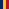 | TD | Chad |
|  | CL | Chile |
|  | CN | China |
|  | CX | Christmas Island |
|  | CC | Cocos (Keeling) Islands |
| 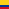 | CO | Colombia |
|  | KM | Comoros |
|  | CG | Congo |
|  | CD | Congo, the Democratic Republic of the |
|  | CK | Cook Islands |
|  | CR | Costa Rica |
|  | CI | Côte d'Ivoire |
|  | HR | Croatia |
|  | CU | Cuba |
|  | CW | Curaçao |
|  | CY | Cyprus |
|  | CZ | Czech Republic |
####D
| D           |ISO | Country
|-------------|----|-----------------
|  | DK | Denmark |
|  | DJ | Djibouti |
| 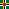 | DM | Dominica |
|  | DO | Dominican Republic |
####E
| E           |ISO | Country
|-------------|----|-----------------
|  | EC | Ecuador |
|  | EG | Egypt |
|  | SV | El Salvador |
|  | GQ | Equatorial Guinea |
|  | ER | Eritrea |
|  | EE | Estonia |
|  | ET | Ethiopia |
####F
| F           |ISO | Country
|-------------|----|-----------------
|  | FK | Falkland Islands (Malvinas) |
| 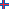 | FO | Faroe Islands |
|  | FJ | Fiji |
|  | FI | Finland |
| 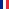 | FR | France |
|  | GF | French Guiana |
|  | PF | French Polynesia |
|  | TF | French Southern Territories |
####G
| G           |ISO | Country
|-------------|----|-----------------
| 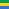 | GA | Gabon |
| 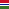 | GM | Gambia |
|  | GE | Georgia |
|  | DE | Germany |
|  | GH | Ghana |
|  | GI | Gibraltar |
| 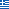 | GR | Greece |
|  | GL | Greenland |
|  | GD | Grenada |
|  | GP | Guadeloupe |
|  | GU | Guam |
|  | GT | Guatemala |
|  | GG | Guernsey |
|  | GN | Guinea |
| 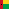 | GW | Guinea-Bissau |
|  | GY | Guyana |
####H
| H           |ISO | Country
|-------------|----|-----------------
|  | HT | Haiti |
|  | HM | Heard Island and McDonald Islands |
|  | VA | Holy See (Vatican City State) |
|  | HN | Honduras |
|  | HK | Hong Kong |
|  | HU | Hungary |
####I
| I           |ISO | Country
|-------------|----|-----------------
|  | IS | Iceland |
|  | IN | India |
|  | ID | Indonesia |
| 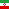 | IR | Iran, Islamic Republic of |
| 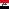 | IQ | Iraq |
|  | IE | Ireland |
|  | IM | Isle of Man |
|  | IL | Israel |
|  | IT | Italy |
####J
| J           |ISO | Country
|-------------|----|-----------------
|  | JM | Jamaica |
|  | JP | Japan |
|  | JE | Jersey |
|  | JO | Jordan |
####K
| K           |ISO | Country
|-------------|----|-----------------
|  | KZ | Kazakhstan |
|  | KE | Kenya |
|  | KI | Kiribati |
|  | KP | Korea, Democratic People's Republic of |
|  | KR | Korea, Republic of |
|  | XK*| Kosovo |
|  | KW | Kuwait |
|  | KG | Kyrgyzstan |
####L
| L           |ISO | Country
|-------------|----|-----------------
|  | LA | Lao People's Democratic Republic |
|  | LV | Latvia |
| 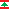 | LB | Lebanon |
|  | LS | Lesotho |
|  | LR | Liberia |
|  | LY | Libya |
|  | LI | Liechtenstein |
|  | LT | Lithuania |
| 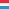 | LU | Luxembourg |
####M
| M           |ISO | Country
|-------------|----|-----------------
|  | MO | Macao |
|  | MK | Macedonia, the former Yugoslav Republic of |
| 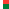 | MG | Madagascar |
|  | MW | Malawi |
|  | MY | Malaysia |
|  | MV | Maldives |
| 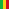 | ML | Mali |
|  | MT | Malta |
|  | MH | Marshall Islands |
|  | MQ | Martinique |
|  | MR | Mauritania |
|  | MU | Mauritius |
| 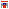 | YT | Mayotte |
|  | MX | Mexico |
|  | FM | Micronesia, Federated States of |
| 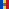 | MD | Moldova, Republic of |
|  | MC | Monaco |
|  | MN | Mongolia |
|  | ME | Montenegro |
|  | MS | Montserrat |
|  | MA | Morocco |
|  | MZ | Mozambique |
|  | MM | Myanmar (Burma) |
####N
| N           |ISO | Country
|-------------|----|-----------------
|  | NA | Namibia |
|  | NR | Nauru |
|  | NP | Nepal |
|  | NL | Netherlands |
|  | NC | New Caledonia |
|  | NZ | New Zealand |
|  | NI | Nicaragua |
|  | NE | Niger |
|  | NG | Nigeria |
| 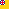 | NU | Niue |
|  | NF | Norfolk Island |
|  | MP | Northern Mariana Islands |
|  | NO | Norway |
####O
| O           |ISO | Country
|-------------|----|-----------------
|  | OM | Oman |
####P
| P           |ISO | Country
|-------------|----|-----------------
|  | PK | Pakistan |
|  | PW | Palau |
|  | PS | Palestine, State of |
|  | PA | Panama |
|  | PG | Papua New Guinea |
| 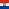 | PY | Paraguay |
|  | PE | Peru |
|  | PH | Philippines |
|  | PN | Pitcairn |
|  | PL | Poland |
| 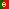 | PT | Portugal |
|  | PR | Puerto Rico |
####Q
| Q           |ISO | Country
|-------------|----|-----------------
|  | QA | Qatar |
####R
| R           |ISO | Country
|-------------|----|-----------------
|  | RE | Réunion |
|  | RO | Romania |
|  | RU | Russian Federation |
| 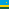 | RW | Rwanda |
####S
| S           |ISO | Country
|-------------|----|-----------------
|  | BL | Saint Barthélemy |
|  | SH | Saint Helena, Ascension and Tristan da Cunha |
| 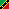 | KN | Saint Kitts and Nevis |
|  | LC | Saint Lucia |
|  | MF | Saint Martin (French part) |
|  | PM | Saint Pierre and Miquelon |
|  | VC | Saint Vincent and the Grenadines |
|  | WS | Samoa |
|  | SM | San Marino |
|  | ST | Sao Tome and Principe |
|  | SA | Saudi Arabia |
| 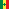 | SN | Senegal |
|  | RS | Serbia |
|  | SC | Seychelles |
|  | SL | Sierra Leone |
|  | SG | Singapore |
|  | SX | Sint Maarten (Dutch part) |
|  | SK | Slovakia |
|  | SI | Slovenia |
|  | SB | Solomon Islands |
|  | SO | Somalia |
|  | ZA | South Africa |
|  | GS | South Georgia and the South Sandwich Islands |
|  | SS | South Sudan |
|  | ES | Spain |
|  | LK | Sri Lanka |
|  | SD | Sudan |
|  | SR | Suriname |
| 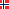 | SJ | Svalbard and Jan Mayen |
|  | SZ | Swaziland |
|  | SE | Sweden |
|  | CH | Switzerland |
|  | SY | Syrian Arab Republic |
####T
| T           |ISO | Country
|-------------|----|-----------------
|  | TW | Taiwan, Province of China |
|  | TJ | Tajikistan |
|  | TZ | Tanzania, United Republic of |
|  | TH | Thailand |
|  | TL | Timor-Leste |
|  | TG | Togo |
|  | TK | Tokelau |
|  | TO | Tonga |
|  | TT | Trinidad and Tobago |
|  | TN | Tunisia |
|  | TR | Turkey |
|  | TM | Turkmenistan |
|  | TC | Turks and Caicos Islands |
|  | TV | Tuvalu |
####U
| U           |ISO | Country
|-------------|----|-----------------
|  | UG | Uganda |
|  | UA | Ukraine |
|  | AE | United Arab Emirates |
|  | GB | United Kingdom |
|  | US | United States |
|  | UM | United States Minor Outlying Islands |
|  | UY | Uruguay |
| 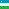 | UZ | Uzbekistan |
####V
| V           |ISO | Country
|-------------|----|-----------------
| 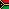 | VU | Vanuatu |
|  | VE | Venezuela, Bolivarian Republic of |
|  | VN | Viet Nam |
|  | VG | Virgin Islands, British |
|  | VI | Virgin Islands, U.S. |
####W
| W           |ISO | Country
|-------------|----|-----------------
|  | WF | Wallis and Futuna  |
|  | EH | Western Sahara |
####Y
| Y           |ISO | Country
|-------------|----|-----------------
|  | YE | Yemen |
####Z
| Z           |ISO | Country
|-------------|----|-----------------
|  | ZM | Zambia |
|  | ZW | Zimbabwe |
