fla9s
=====

9x9 flags

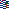

 |ISO | Country
-------------:|----|-----------------
 | AF | Afghanistan
 | AX | Åland Islands
 | AL | Albania
 | DZ | Algeria
 | AS | American Samoa
 | AD | Andorra
 | AO | Angola
 | AI | Anguilla
 | AQ | Antarctica
 | AG | Antigua and Barbuda
 | AR | Argentina
 | AM | Armenia
 | AW | Aruba
 | AU | Australia
 | AT | Austria
 | AZ | Azerbaijan
 | BS | Bahamas
 | BH | Bahrain
 | BD | Bangladesh
 | BB | Barbados
 | BY | Belarus
 | BE | Belgium
 | BZ | Belize
 | BJ | Benin
 | BM | Bermuda
 | BT | Bhutan
 | BO | Bolivia, Plurinational State of
 | BQ | Bonaire, Sint Eustatius and Saba
 | BA | Bosnia and Herzegovina
 | BW | Botswana
 | BV | Bouvet Island
 | BR | Brazil
 | IO | British Indian Ocean Territory
 | BN | Brunei Darussalam
 | BG | Bulgaria
 | BF | Burkina Faso
 | BI | Burundi
 | KH | Cambodia
 | CM | Cameroon
 | CA | Canada
 | CV | Cabo Verde
 | KY | Cayman Islands
 | CF | Central African Republic
 | TD | Chad
 | CL | Chile
 | CN | China
 | CX | Christmas Island
 | CC | Cocos (Keeling) Islands
 | CO | Colombia
 | KM | Comoros
 | CG | Congo
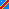 | CD | Congo, the Democratic Republic of the
 | CK | Cook Islands
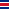 | CR | Costa Rica
 | CI | Côte d'Ivoire
 | HR | Croatia
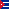 | CU | Cuba
 | CW | Curaçao 
 | CY | Cyprus
 | CZ | Czech Republic
 | DK | Denmark
 | DJ | Djibout
 | DM | Dominica
 | DO | Dominican Republic
 | EC | Ecuador
 | EG | Egypt
 | SV | El Salvador
 | GQ | Equatorial Guinea
 | ER | Eritrea
 | EE | Estonia
 | ET | Ethiopia
 | FK | Falkland Islands (Malvinas)
 | FO | Faroe Islands
 | FJ | Fiji
 | FI | Finland
 | FR | France
 | GF | French Guiana
 | PF | French Polynesia
 | TF | French Southern Territories
 | GA | Gabon
 | GM | Gambia
 | GE | Georgia
 | DE | Germany
 | GH | Ghana
 | GI | Gibraltar
 | GR | Greece
 | GL | Greenland
 | GD | Grenada
 | GP | Guadeloupe
 | GU | Guam
 | GT | Guatemala
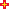 | GG | Guernsey
 | GN | Guinea
 | GW | Guinea-Bissau
 | GY | Guyana
 | HT | Haiti
() | HM | Heard Island and McDonald Islands
 | VA | Holy See (Vatican City State)
 | HN | Honduras
 | HK | Hong Kong
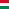 | HU | Hungary
 | IS | Iceland
 | IN | India
 | ID | Indonesia
 | IR | Iran, Islamic Republic of
 | IQ | Iraq
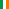 | IE | Ireland
 | IM | Isle of Man
 | IL | Israel
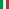 | IT | Italy
 | JM | Jamaica
 | JP | Japan
 | JE | Jersey
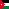 | JO | Jordan
 | KZ | Kazakhstan
 | KE | Kenya
 | KI | Kiribati
 | KP | Korea, Democratic People's Republic of
 | KR | Korea, Republic of
 | XK*| Kosovo
 | KW | Kuwait
 | KG | Kyrgyzstan
 | LA | Lao People's Democratic Republic
 | LV | Latvia
 | LB | Lebanon
 | LS | Lesotho
 | LR | Liberia
 | LY | Libya
 | LI | Liechtenstein
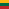 | LT | Lithuania
 | LU | Luxembourg
 | MO | Macao
 | MK | Macedonia, the former Yugoslav Republic of
 | MG | Madagascar
 | MW | Malawi
 | MY | Malaysia
 | MV | Maldives
 | ML | Mali
 | MT | Malta
 | MH | Marshall Islands
 | MQ | Martinique
 | MR | Mauritania
 | MU | Mauritius
 | YT | Mayotte
 | MX | Mexico
 | FM | Micronesia, Federated States of
 | MD | Moldova, Republic of
 | MC | Monaco
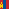 | MN | Mongolia
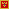 | ME | Montenegro
 | MS | Montserrat
 | MA | Morocco
 | MZ | Mozambique
 | MM | Myanmar (Burma)
 | NA | Namibia
 | NR | Nauru
 | NP | Nepal
 | NL | Netherlands
 | NC | New Caledonia
 | NZ | New Zealand
 | NI | Nicaragua
 | NE | Niger
 | NG | Nigeria
 | NU | Niue
 | NF | Norfolk Island
 | MP | Northern Mariana Islands
 | NO | Norway
 | OM | Oman
 | PK | Pakistan
 | PW | Palau
 | PS | Palestine, State of
 | PA | Panama
 | PG | Papua New Guinea
 | PY | Paraguay
 | PE | Peru
 | PH | Philippines
 | PN | Pitcairn
 | PL | Poland
 | PT | Portugal
 | PR | Puerto Rico
 | QA | Qatar
 | RE | Réunion
 | RO | Romania
 | RU | Russian Federation
 | RW | Rwanda
 | BL | Saint Barthélemy
 | SH | Saint Helena, Ascension and Tristan da Cunha
 | KN | Saint Kitts and Nevis
 | LC | Saint Lucia
 | MF | Saint Martin (French part)
 | PM | Saint Pierre and Miquelon
 | VC | Saint Vincent and the Grenadines
 | WS | Samoa
 | SM | San Marino
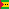 | ST | Sao Tome and Principe
 | SA | Saudi Arabia
 | SN | Senegal
 | RS | Serbia
 | SC | Seychelles
 | SL | Sierra Leone
 | SG | Singapore
 | SX | Sint Maarten (Dutch part)
 | SK | Slovakia
 | SI | Slovenia
 | SB | Solomon Islands
 | SO | Somalia
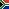 | ZA | South Africa
/ | GS | South Georgia and the South Sandwich Islands
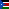 | SS | South Sudan
 | ES | Spain
 | LK | Sri Lanka
 | SD | Sudan
 | SR | Suriname
 | SJ | Svalbard and Jan Mayen
 | SZ | Swaziland
 | SE | Sweden
 | CH | Switzerland
 | SY | Syrian Arab Republic
 | TW | Taiwan, Province of China
 | TJ | Tajikistan
 | TZ | Tanzania, United Republic of
 | TH | Thailand
 | TL | Timor-Leste
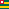 | TG | Togo
 | TK | Tokelau
 | TO | Tonga
 | TT | Trinidad and Tobago
 | TN | Tunisia
 | TR | Turkey
 | TM | Turkmenistan
 | TC | Turks and Caicos Islands
 | TV | Tuvalu
 | UG | Uganda
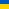 | UA | Ukraine
 | AE | United Arab Emirates
 | GB | United Kingdom
 | US | United States
 | UM | United States Minor Outlying Islands
 | UY | Uruguay
 | UZ | Uzbekistan
 | VU | Vanuatu
 | VE | Venezuela, Bolivarian Republic of
 | VN | Viet Nam
 | VG | Virgin Islands, British
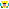 | VI | Virgin Islands, U.S.
 | WF | Wallis and Futuna
 | EH | Western Sahara
 | YE | Yemen
 | ZM | Zambia
 | ZW | Zimbabwe
