fla9s
=====

9x9 flags

 |ISO | Country
--------------|----|-----------------
 | AF | Afghanistan
 | AX | Åland Islands
 | AL | Albania
 | DZ | Algeria
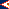 | AS | American Samoa
 | AD | Andorra
 | AO | Angola
 | AI | Anguilla
 | AQ | Antarctica
 | AG | Antigua and Barbuda
 | AR | Argentina
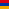 | AM | Armenia
 | AW | Aruba
 | AU | Australia
 | AT | Austria
 | AZ | Azerbaijan
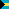 | BS | Bahamas
 | BH | Bahrain
 | BD | Bangladesh
 | BB | Barbados
 | BY | Belarus
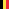 | BE | Belgium
 | BZ | Belize
 | BJ | Benin
 | BM | Bermuda
 | BT | Bhutan
 | BO | Bolivia, Plurinational State of
 | BQ | Bonaire, Sint Eustatius and Saba
 | BA | Bosnia and Herzegovina
 | BW | Botswana
 | BV | Bouvet Island
 | BR | Brazil
 | IO | British Indian Ocean Territory
 | BN | Brunei Darussalam
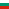 | BG | Bulgaria
 | BF | Burkina Faso
 | BI | Burundi
 | KH | Cambodia
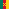 | CM | Cameroon
 | CA | Canada
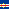 | CV | Cabo Verd
 | KY | Cayman Islands
 | CF | Central African Republic
 | TD | Chad
 | CL | Chile
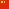 | CN | China
 | CX | Christmas Island
 | CC | Cocos (Keeling) Islands
 | CO | Colombia
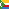 | KM | Comoros
 | CG | Congo
 | CD | Congo, the Democratic Republic of the
 | CK | Cook Islands
 | CR | Costa Rica
 | CI | Côte d'Ivoire
 | HR | Croatia
 | CU | Cuba
 | CW | Curaçao 
 | CY | Cyprus
 | CZ | Czech Republic
 | DK | Denmark
 | DJ | Djibout
 | DM | Dominica
 | DO | Dominican Republic
 | EC | Ecuador
 | EG | Egypt
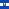 | SV | El Salvador
 | GQ | Equatorial Guinea
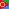 | ER | Eritrea
 | EE | Estonia
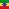 | ET | Ethiopia
 | FK | Falkland Islands (Malvinas)
 | FO | Faroe Islands
 | FJ | Fiji
 | FI | Finland
 | FR | France
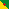 | GF | French Guiana
 | PF | French Polynesia
 | TF | French Southern Territories
 | GA | Gabon
 | GM | Gambia
 | GE | Georgia
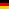 | DE | Germany
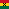 | GH | Ghana
 | GI | Gibraltar
 | GR | Greece
 | GL | Greenland
 | GD | Grenada
 | GP | Guadeloupe
 | GU | Guam
 | GT | Guatemala
 | GG | Guernsey
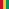 | GN | Guinea
 | GW | Guinea-Bissau
 | GY | Guyana
 | HT | Haiti
 | HM | Heard Island and McDonald Islands
 | VA | Holy See (Vatican City State)
 | HN | Honduras
 | HK | Hong Kong
 | HU | Hungary
 | IS | Iceland
 | IN | India
 | ID | Indonesia
 | IR | Iran, Islamic Republic of
 | IQ | Iraq
 | IE | Ireland
 | IM | Isle of Man
 | IL | Israel
 | IT | Italy
 | JM | Jamaica
 | JP | Japan
 | JE | Jersey
 | JO | Jordan
 | KZ | Kazakhstan
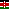 | KE | Kenya
 | KI | Kiribati
 | KP | Korea, Democratic People's Republic of
 | KR | Korea, Republic of
 | XK*| Kosovo
 | KW | Kuwait
 | KG | Kyrgyzstan
 | LA | Lao People's Democratic Republic
 | LV | Latvia
 | LB | Lebanon
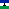 | LS | Lesotho
 | LR | Liberia
 | LY | Libya
 | LI | Liechtenstein
 | LT | Lithuania
 | LU | Luxembourg
 | MO | Macao
 | MK | Macedonia, the former Yugoslav Republic of |
 | MG | Madagascar |
 | MW | Malawi |
 | MY | Malaysia |
 | MV | Maldives |
 | ML | Mali |
 | MT | Malta |
 | MH | Marshall Islands |
 | MQ | Martinique |
 | MR | Mauritania |
 | MU | Mauritius |
 | YT | Mayotte |
 | MX | Mexico |
 | FM | Micronesia, Federated States of |
 | MD | Moldova, Republic of |
 | MC | Monaco |
 | MN | Mongolia |
 | ME | Montenegro |
 | MS | Montserrat |
 | MA | Morocco |
 | MZ | Mozambique |
 | MM | Myanmar (Burma) |
 | NA | Namibia |
 | NR | Nauru |
 | NP | Nepal |
 | NL | Netherlands |
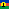 | NC | New Caledonia |
 | NZ | New Zealand |
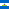 | NI | Nicaragua |
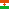 | NE | Niger |
 | NG | Nigeria |
 | NU | Niue |
 | NF | Norfolk Island |
 | MP | Northern Mariana Islands |
 | NO | Norway |
 | OM | Oman |
 | PK | Pakistan |
 | PW | Palau |
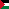 | PS | Palestine, State of |
 | PA | Panama |
 | PG | Papua New Guinea |
 | PY | Paraguay |
 | PE | Peru |
 | PH | Philippines |
 | PN | Pitcairn |
 | PL | Poland |
 | PT | Portugal |
 | PR | Puerto Rico |
 | QA | Qatar |
 | RE | Réunion |
 | RO | Romania |
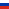 | RU | Russian Federation |
 | RW | Rwanda |
 | BL | Saint Barthélemy |
 | SH | Saint Helena, Ascension and Tristan da Cunha |
 | KN | Saint Kitts and Nevis |
 | LC | Saint Lucia |
 | MF | Saint Martin (French part) |
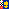 | PM | Saint Pierre and Miquelon |
 | VC | Saint Vincent and the Grenadines |
 | WS | Samoa |
 | SM | San Marino |
 | ST | Sao Tome and Principe |
 | SA | Saudi Arabia |
 | SN | Senegal |
 | RS | Serbia |
 | SC | Seychelles |
 | SL | Sierra Leone |
 | SG | Singapore |
 | SX | Sint Maarten (Dutch part) |
 | SK | Slovakia |
 | SI | Slovenia |
 | SB | Solomon Islands |
 | SO | Somalia |
 | ZA | South Africa |
 | GS | South Georgia and the South Sandwich Islands |
 | SS | South Sudan |
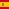 | ES | Spain |
 | LK | Sri Lanka |
 | SD | Sudan |
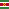 | SR | Suriname |
 | SJ | Svalbard and Jan Mayen |
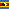 | SZ | Swaziland |
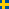 | SE | Sweden |
 | CH | Switzerland |
 | SY | Syrian Arab Republic |
 | TW | Taiwan, Province of China |
 | TJ | Tajikistan |
 | TZ | Tanzania, United Republic of |
 | TH | Thailand |
 | TL | Timor-Leste |
 | TG | Togo |
 | TK | Tokelau |
 | TO | Tonga |
 | TT | Trinidad and Tobago |
 | TN | Tunisia |
 | TR | Turkey |
 | TM | Turkmenistan |
 | TC | Turks and Caicos Islands |
 | TV | Tuvalu |
 | UG | Uganda |
 | UA | Ukraine |
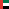 | AE | United Arab Emirates |
 | GB | United Kingdom |
 | US | United States |
 | UM | United States Minor Outlying Islands |
 | UY | Uruguay |
 | UZ | Uzbekistan |
 | VU | Vanuatu |
 | VE | Venezuela, Bolivarian Republic of |
 | VN | Viet Nam |
 | VG | Virgin Islands, British |
 | VI | Virgin Islands, U.S. |
 | WF | Wallis and Futuna  |
 | EH | Western Sahara |
 | YE | Yemen |
 | ZM | Zambia |
 | ZW | Zimbabwe |
